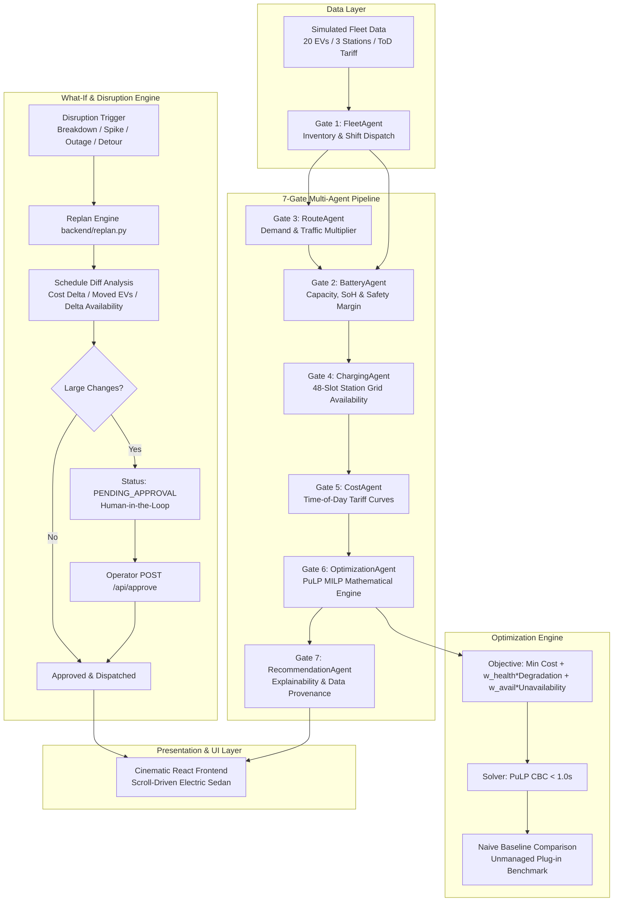

# Virexa — AI Energy & EV Fleet Optimization Agent

> **Charge smart. Run longer. Spend less.**
> *Autonomous multi-agent system and cinematic, scroll-driven EV fleet charging optimization platform for commercial urban fleets.*

---

## 1. Executive Summary

Commercial electric vehicle (EV) fleets in India—ranging from 3-wheeler e-rickshaws to e-commerce delivery vans and campus passenger shuttles—suffer from severe operational and financial inefficiencies when charging is unmanaged. Indiscriminate plug-in at the end of shifts drives massive surge electricity bills under Time-of-Day (ToD) tariffs, causes accelerated battery cell degradation from unwarranted fast charging (>0.8C), and results in depot grid bottlenecks that cause missed morning delivery SLAs.

**Virexa** solves this with an autonomous 7-agent pipeline powered by a Mixed-Integer Linear Programming (MILP) solver that balances four core objectives:
1. **Charging Cost (INR)** — Arbitraging off-peak night rates (₹5/kWh) and solar windows (₹6/kWh) over peak hours (₹11/kWh).
2. **Battery Health (SoH)** — Discouraging fast-charging on smaller packs to avoid thermal wear and cell degradation.
3. **Operational Availability** — Guaranteeing target battery SoC with a mandatory 15% safety buffer before shift departure.
4. **Physical Constraints** — Strictly respecting station slot limits, transformer ceilings, and maintenance down-hours.

Every decision is audited with **GIVEN vs ASSUMED** data provenance, and **human-in-the-loop** operators retain final authority over disruptions.

---

## 2. Multi-Agent Architecture



---

## 3. The 7 Specialized Agents

| Gate | Agent Name | Primary Responsibility | Provenance Tags |
| :---: | :--- | :--- | :--- |
| **01** | **FleetAgent** | Ingests 20 vehicles (8 e-rickshaws, 7 vans, 5 shuttles) and shift schedules. | **GIVEN**: IDs, pack sizes, max kW, initial SoC. |
| **02** | **BatteryAgent** | Computes target SoC with mandatory 15% safety buffer; calculates degradation vulnerability. | **GIVEN**: Pack kWh, SoH.<br/>**ASSUMED**: 15% safety buffer ratio. |
| **03** | **RouteAgent** | Forecasts dynamic kWh demand from planned km, load factor, and traffic/weather. | **GIVEN**: Planned km, base kWh/km.<br/>**ASSUMED**: 1.10x traffic multiplier. |
| **04** | **ChargingAgent** | Builds 48-slot (30-min resolution) availability grid across S1, S2, and S3 stations. | **GIVEN**: Station slots, rated kW.<br/>**ASSUMED**: Maintenance windows. |
| **05** | **CostAgent** | Discretizes 24h ToD electricity tariffs into slot economic signals (₹5 to ₹11/kWh). | **ASSUMED**: Delhi NCR ToD tariff tiers. |
| **06** | **OptimizationAgent** | PuLP MILP formulation with binary $x[v,s,t]$ slot allocation and continuous $e[v,s,t]$ energy flow. | **GIVEN**: Physical limits.<br/>**ASSUMED**: Multi-objective weights. |
| **07** | **RecommendationAgent** | Generates plain-language explainability without changing any numeric outputs. | **GIVEN / ASSUMED**: Tagged per vehicle. |

---

## 4. Mathematical Formulation

$$\min \sum_{v,s,t} e_{v,s,t} \cdot \text{Tariff}_{h(t)} + w_{health} \sum_{v,s,t} e_{v,s,t} \cdot \text{Degradation}_{v,s} + w_{avail} \sum_v \text{deficit}_v \cdot 150.0$$

**Subject to:**
1. **Power Rating Limits:** $e_{v,s,t} \le \min(P^{max}_v, P^{max}_s) \cdot \Delta t \cdot x_{v,s,t}$
2. **Single Bay Rule:** $\sum_{s} x_{v,s,t} \le 1 \quad \forall v, t$
3. **Station Bay Capacity:** $\sum_v x_{v,s,t} \le C_{s,t} \quad \forall s, t$
4. **No Charging on Active Shift:** $x_{v,s,t} = 0 \quad \forall t \in \text{Shift}_v$
5. **Station Down Hours:** $x_{v,s,t} = 0 \quad \forall t \text{ where } h(t) \in \text{DownHours}_s$
6. **Shift Readiness Guarantee:** $\text{InitialEnergy}_v + \sum_{t < t_{start}} e_{v,s,t} + \text{deficit}_v \ge \text{TargetSoC}_v \cdot \text{Capacity}_v$

---

## 5. Technology Stack

- **Backend:** Python 3.10+, FastAPI, PuLP MILP (CBC Solver), pandas, numpy, python-dotenv, pytest, httpx
- **Frontend:** React 18, Vite, TypeScript, TailwindCSS, GSAP + ScrollTrigger, Framer Motion, Recharts, Lenis Smooth Scroll, Canvas Confetti
- **Testing:** 15 unit and integration tests across data generation, MILP solver, agent pipeline, diffing, and REST endpoints.

---

## 6. Setup & Execution

### Prerequisites
- Python 3.10+ (tested with Python 3.13)
- Node.js 18+ (tested with Node 20.18 LTS)

### 1. Backend Setup
```bash
# From repository root
pip install -r requirements.txt

# Run the FastAPI server
uvicorn backend.main:app --reload --port 8000
```
Interactive OpenAPI documentation will be accessible at: `http://localhost:8000/docs`

### 2. Frontend Setup
```bash
cd frontend
npm install
npm run dev
```
Open `http://localhost:5173` to experience the cinematic scroll platform.

### 3. Run Test Suite
```bash
pytest -v
```

---

## 7. Two-Minute Hackathon Demo Script

| Time | Story Chapter | Action / Speaking Points |
| :---: | :--- | :--- |
| **0:00 - 0:20** | **1. Hero & Branding** | Point to the sleek electric sedan on the road. Explain the core problem: Indian commercial EV fleets face peak electricity tariffs (₹11/kWh) and battery wear. Virexa is the autonomous agent that fixes this. |
| **0:20 - 0:40** | **2. The Problem & Fleet** | Scroll down. Show the car driving along the road as wheels rotate. Highlight the 20-EV fleet (8 e-rickshaws, 7 delivery vans, 5 shuttles) with live SoC circular rings and battery health bars. |
| **0:40 - 1:00** | **3. The 7 AI Agents** | Watch the car pass the 7 Agent Gates. Point out the live telemetry for each gate: Fleet, Battery, Route, Charging, Cost, Optimization, Recommendation. Note: "Optimization solves in under 0.7 seconds with zero LLM hallucinations." |
| **1:00 - 1:20** | **4. Sliders & Gantt** | Drag the **Cost Minimization** or **Battery Health** trade-off slider. Click *Re-Run Optimizer*. Point to the Gantt chart: vehicles immediately reallocate to solar (green) and night off-peak (cyan). |
| **1:20 - 1:40** | **5. Savings & Explainability** | Showcase the large animated counter showing ₹X saved (7-25% arbitrage) vs unmanaged naive plug-in. Click on vehicle **V07** in the *Explain It* section to reveal the plain-language explanation and **GIVEN vs ASSUMED** chips. |
| **1:40 - 2:00** | **6. What-If & Approval** | Click **"Station S1 Outage"**. Road flashes red, affected vehicles glow, and the DIFF table shows where vehicles moved. Click **"Approve New Fleet Plan"**—confetti explodes, and the car reaches the glowing finish terminal. Human stays in control! |

---

## 8. Assumptions List

1. **Electricity Tariff Structure:** Hourly Time-of-Day (ToD) tariff modeled after Indian industrial grid profiles (Delhi / Haryana):
   - Off-Peak Night (00:00 - 06:00): ₹5.00/kWh
   - Solar Generation Window (10:00 - 16:00): ₹6.00/kWh
   - Standard Normal Window: ₹8.00/kWh
   - Evening Peak Demand (18:00 - 22:00): ₹11.00/kWh
2. **Operational Safety Buffer:** A 15% safety buffer ratio is added to route energy demand to safeguard against traffic delays or AC usage before shift start. Minimum baseline SoC is clamped at 65%.
3. **Traffic & Weather Multiplier:** Base consumption is scaled by an assumed 1.10x multiplier to simulate Delhi NCR urban congestion.
4. **Battery Degradation Penalty:** Charging rates exceeding 0.8C trigger accelerated degradation penalties in the MILP objective function, weighted inversely by battery State of Health (SoH).
5. **Station Maintenance Windows:** Depot Main (S1) undergoes a 1-hour maintenance window at 13:00; Public Fast (S3) has grid peak moratoriums at 19:00 - 21:00.
6. **Discretization:** The 24-hour horizon is discretized into 48 slots of 30 minutes ($\Delta t = 0.5$ h). Charging power modulation is continuous up to station/vehicle physical limits.

---

## 9. Screenshots Placeholder

| Hero & Cinematic Electric Sedan | 24-Hour Gantt Schedule Matrix |
| :---: | :---: |
| *(Hero section with floating battery HUD and rotating wheels)* | *(Gantt chart overlaid on 24h electricity tariff line)* |

| Multi-Objective Tradeoff Sliders | What-If Replan DIFF & Operator Approval |
| :---: | :---: |
| *(Interactive sliders for Cost, Health, and Availability)* | *(Disruption impact diff and human-in-the-loop terminal)* |
